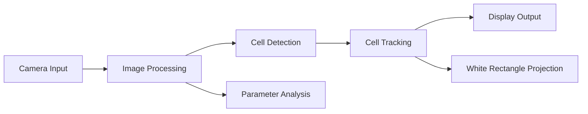

# Cell Tracking System Technical Roadmap

## 1. System Architecture
```
├── Main Application (cell_tracking_for_usbcam.py)
├── Parameter Control UI (parameter_control.py)
├── Calibration System (calibration.py)
└── Analysis Tools (snapshot_analyzer.py)
```

## 2. Core Components & Features

### 2.1 Cell Detection Pipeline
1. **Image Acquisition**
   - USB camera integration
   - Real-time frame capture
   - Configurable camera selection (CAMERASELECTED)

2. **Image Processing**
   - Grayscale conversion
   - CLAHE enhancement (Contrast Limited Adaptive Histogram Equalization)
   - Gaussian denoising
   - Kirsch edge detection (4 directional filters)
   - Morphological operations
   - Cell region detection and filtering

3. **Cell Tracking**
   - Temporal persistence (CELL_MEMORY_FRAMES)
   - Bounding box tracking
   - Movement prediction
   - IoU (Intersection over Union) calculations

### 2.2 User Interface Components

1. **Main Control Panel**
   - Parameter adjustment controls
   - Real-time visualization
   - Always-on-top window management

2. **Display Windows**
   - Cell Detection View (processed frame)
   - White Rectangles View (projection output)
   - Analysis Results Window

### 2.3 Calibration System

1. **Camera-Projector Calibration**
   - Circle detection algorithm
   - Coordinate transformation
   - Perspective correction
   - Manual calibration interface

### 2.4 Analysis Tools

1. **Snapshot Analyzer**
   - Parameter optimization
   - Region labeling
   - Statistical analysis
   - Result visualization

## 3. Key Parameters

### 3.1 Cell Detection Parameters
- Area range (min/max)
- Perimeter range (min/max)
- Circularity range (min/max)

### 3.2 Tracking Parameters
- Cell memory frames
- Maximum movement threshold
- Distance threshold

### 3.3 Image Processing Parameters
- CLAHE clip limit
- CLAHE tile size
- Gaussian blur parameters
- Morphological operation settings

## 4. Data Flow



## 5. Features for Users

### 5.1 Real-time Operations
- Live cell detection and tracking
- Interactive parameter adjustment
- Real-time visualization

### 5.2 Analysis Tools
- Parameter snapshot analysis
- Processing steps visualization
- Region labeling interface

### 5.3 System Configuration
- Camera selection
- Window management
- Calibration settings

## 6. Technical Implementation Notes

1. **Performance Optimizations**
   - OpenCV-based image processing
   - Efficient memory management
   - Optimized display updates

2. **Error Handling**
   - Camera connection validation
   - Calibration verification
   - Parameter range checking

3. **UI/UX Considerations**
   - Always-on-top windows for critical displays
   - Intuitive parameter controls
   - Real-time feedback

## 7. Getting Started

1. **System Requirements**
   - Python 3.x
   - OpenCV
   - NumPy
   - scikit-image
   - Tkinter

2. **Running the Application**
   ```bash
   python cell_tracking_for_usbcam.py
   ```

3. **Initial Setup**
   - Run calibration first if not previously calibrated
   - Adjust camera selection if needed (CAMERASELECTED in code)
   - Configure initial parameters through the control panel

## 8. Tips for Development

1. **Code Organization**
   - Each module is self-contained with specific responsibilities
   - Parameter control is centralized in the UI
   - Image processing pipeline is modular and extensible

2. **Debugging**
   - Use process_frame_debug() for step-by-step visualization
   - Snapshot analyzer helps in parameter optimization
   - Check console output for warnings and errors

3. **Performance**
   - Monitor frame processing time
   - Adjust parameters for balance between accuracy and speed
   - Consider hardware capabilities when configuring image resolution
